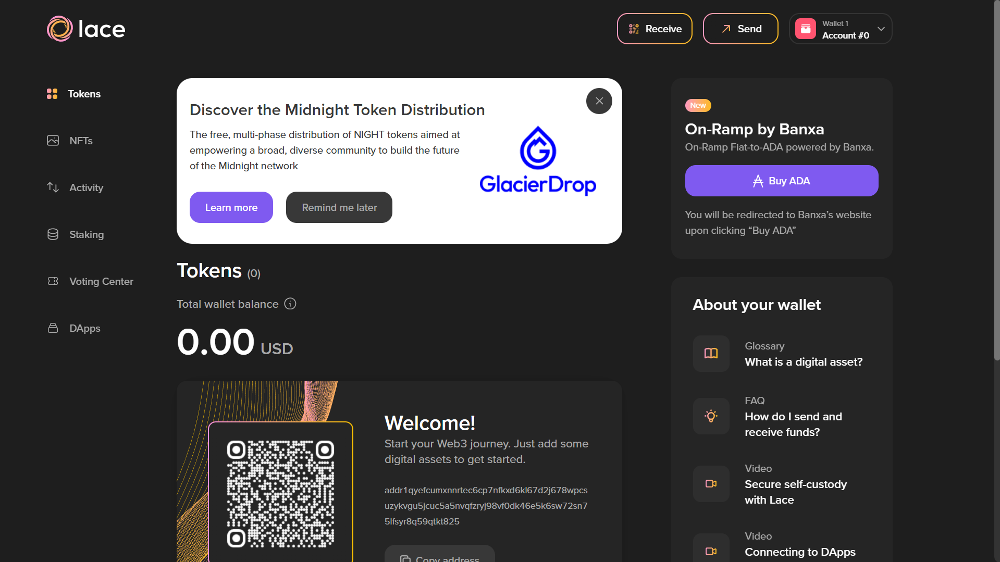
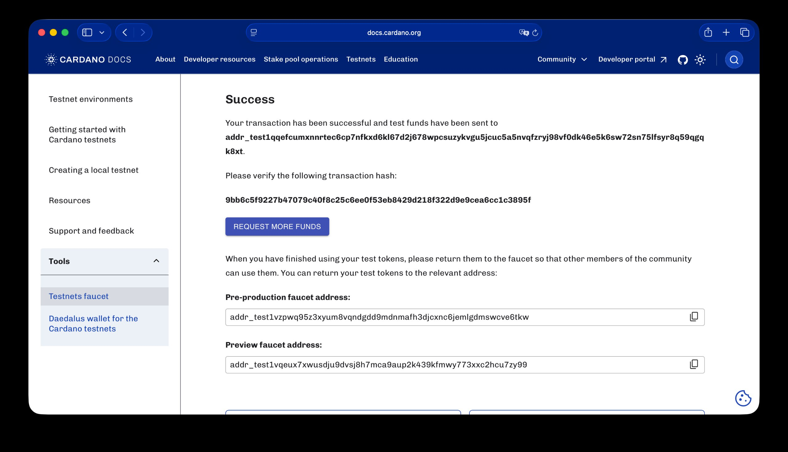
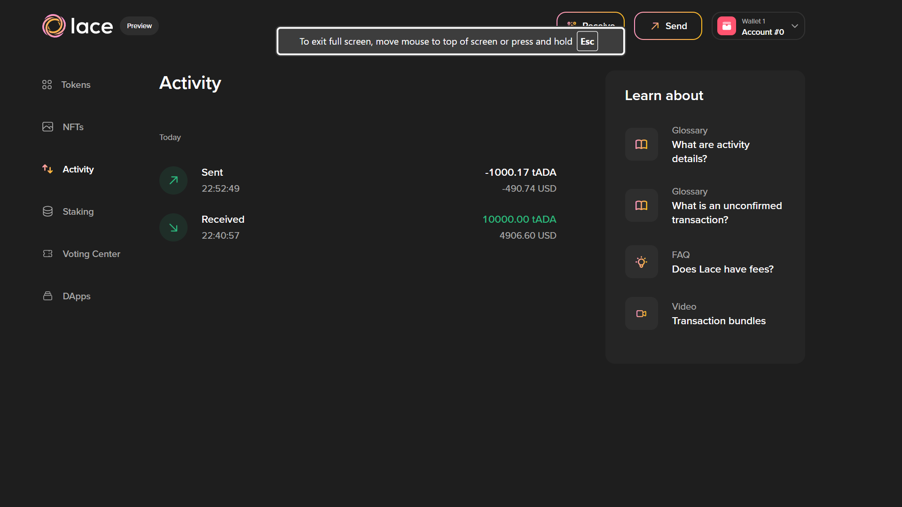
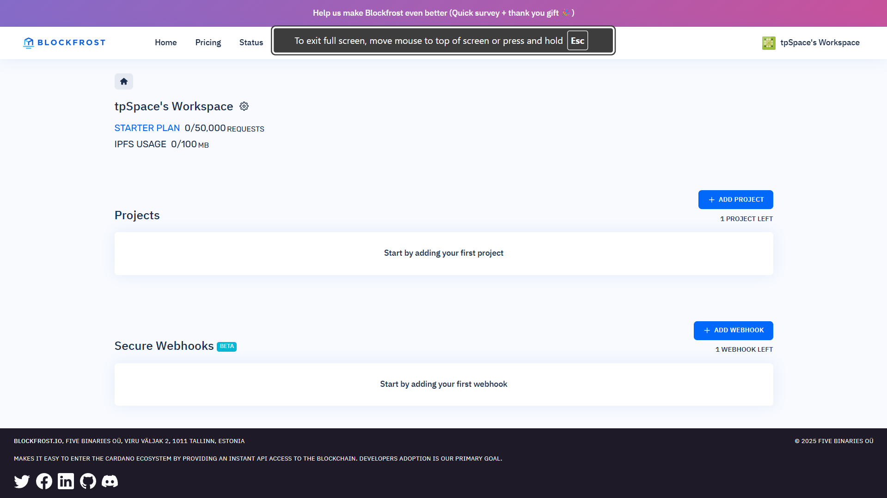
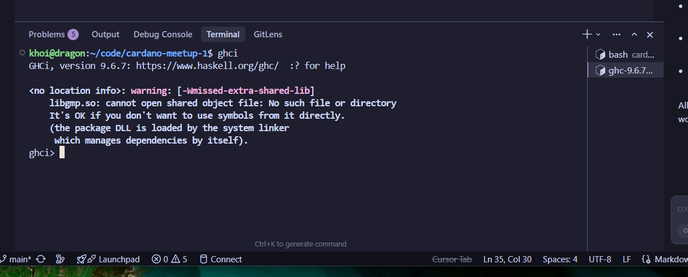

## Task 1: Create your first wallet

- Name of wallet (Lace/Nami): Lace
- Wallet address:

```bash
addr1qyefcumxnnrtec6cp7nfkxd6kl67d2j678wpcsuzykvgu5jcuc5a5nvqfzryj98vf0dk46e5k6sw72sn75lfsyr8q59qtkt825
```

- Screenshot of wallet creation: 

## Task 2: Get testnet ADA (faucet)

- Faucet used: [https://docs.cardano.org/cardano-testnets/tools/faucet](https://docs.cardano.org/cardano-testnets/tools/faucet)
- Amount received: 10,000
- Transaction ID (URL): [https://preview.cexplorer.io/tx/9bb6c5f9227b47079c40f8c25c6ee0f53eb8429d218f322d9e9cea6cc1c3895f](https://preview.cexplorer.io/tx/9bb6c5f9227b47079c40f8c25c6ee0f53eb8429d218f322d9e9cea6cc1c3895f)
- Screenshot of receipt: 

## Task 3: Send your first transaction

- From address: addr_test1qqefcumxnnrtec6cp7nfkxd6kl67d2j678wpcsuzykvgu5jcuc5a5nvqfzryj98vf0dk46e5k6sw72sn75lfsyr8q59qgqk8xt
- To address: addr_test1qzu0yrtj3hec8qsufrxje35dltq52l4ycttnx0r6v8d40fkpld7e222fjgedxec2yzul0wh2thhjzvtx4amkg0ljgxks200tvc
- Transaction ID (URL): [https://preview.cexplorer.io/tx/20f731b16e4d8d0f075c06d30cd115cb139f4a88134111422129e759360d7277](https://preview.cexplorer.io/tx/20f731b16e4d8d0f075c06d30cd115cb139f4a88134111422129e759360d7277)
- Screenshot of transaction: 

## Task 4: Explore Blockfrost dashboard

- Blockfrost dashboard URL: [https://blockfrost.io/dashboard](https://blockfrost.io/dashboard)
- Screenshot of dashboard:  
- Brief summary of what you explored: Blockfrost.io is a scalable API service providing easy access to the Cardano blockchain, with over 100 endpoints for tasks like querying transactions, blocks, assets, and more, aimed at developers building dApps without managing their own infrastructure. The dashboard at https://blockfrost.io/dashboard serves as the central user portal, where you can sign in via social networks or email (no full registration required), create and manage API projects, obtain API keys, monitor usage metrics, handle subscriptions and billing (including free and paid plans from Starter to Enterprise), and access status updates or documentation. It's essentially a control center for overseeing your Blockfrost account and API interactions.

## Task 5: Download Development Tools

- Tools downloaded (list): Haskell, Aiken
- Screenshot of installation:  

---
### Submission Requirements

- Screenshots for each step (wallets, faucet, transaction, dashboard, tools)
- Transaction URLs for faucet and your first send
- Wallet addresses (as applicable)
- Summary of steps performed

---
**Feel free to fork this repository and submit your proof by opening an issue and uploading required screenshots, transaction URLs, and addresses as outlined above.**
